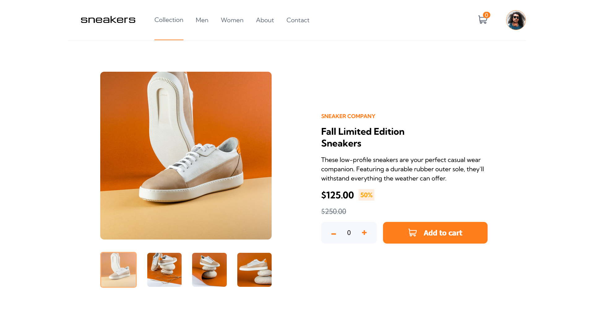

# Frontend Mentor - E-commerce product page solution

This is a solution to the [E-commerce product page challenge on Frontend Mentor](https://www.frontendmentor.io/challenges/ecommerce-product-page-UPsZ9MJp6). Frontend Mentor challenges help you improve your coding skills by building realistic projects.

## Table of contents

- [Overview](#overview)
  - [The challenge](#the-challenge)
  - [Screenshot](#screenshot)
  - [Links](#links)
- [My process](#my-process)
  - [Built with](#built-with)
  - [What I learned](#what-i-learned)
  - [Continued development](#continued-development)
- [Author](#author)
- [Acknowledgments](#acknowledgments)

**Note: Delete this note and update the table of contents based on what sections you keep.**

## Overview

### The challenge

Users should be able to:

- View the optimal layout for the site depending on their device's screen size
- See hover states for all interactive elements on the page
- Open a lightbox gallery by clicking on the large product image
- Switch the large product image by clicking on the small thumbnail images
- Add items to the cart
- View the cart and remove items from it

### Screenshot

### Links

- Solution URL: [Add solution URL here](https://github.com/Mzota2/SneakersSite)
- Live Site URL: [Add live site URL here](https://mzota2.github.io/SneakersSite/)

## My process

### Built with

- Semantic HTML5
- CSS custom properties
- Flexbox
- Mobile-first workflow
- [React](https://reactjs.org/) - JS library

### What I learned

The project has added and boosted my skills in creating responsive layouts using mobile first approach. It has also acted sharpened my skills in algorithms, state management and localstorage managament.

### Continued development

From this project has also enlightened me on the areas that i have to improve on such as creating re-usable and easy to update styles,  managing state in react app and creating re-usable react components.

## Author

- Website - [Emmanuel Mzota](https://mzota-portfolio.onrender.com/)
- Frontend Mentor - [@Mzota2](https://www.frontendmentor.io/profile/Mzota2)
- Twitter - [@mzotacodes](https://www.twitter.com/mzotacodes)
- Instagram - [@mzotacodes](https://www.instagram.com/mzotacodes)

